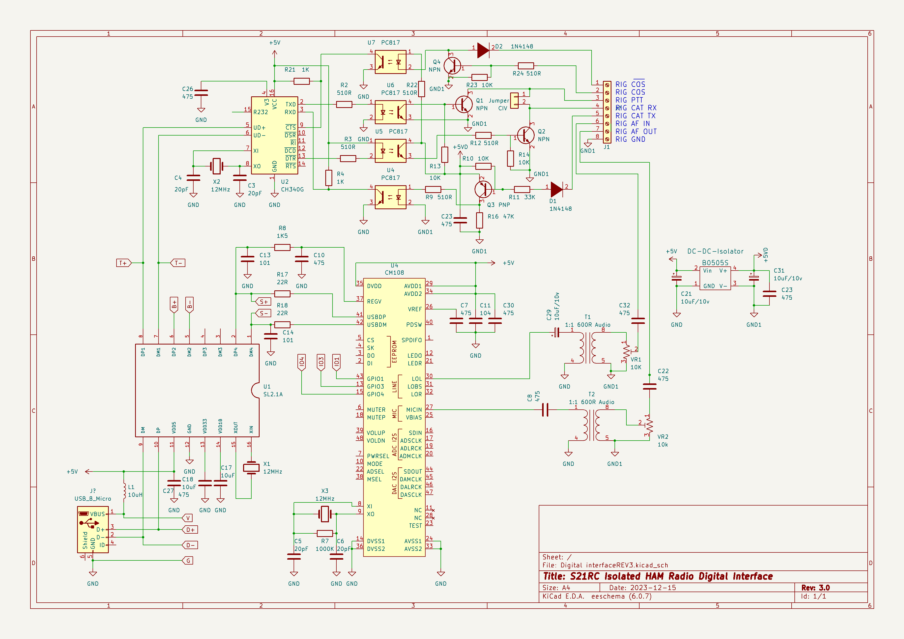

# ham-radio-digital-interface

V3.0:
* COS and Inverted COS added
* Basic components changed to 0603 package for availibility.
* TLP241-4 replaced by 4x 817 optocoupler for cheaper cost and availibility.

